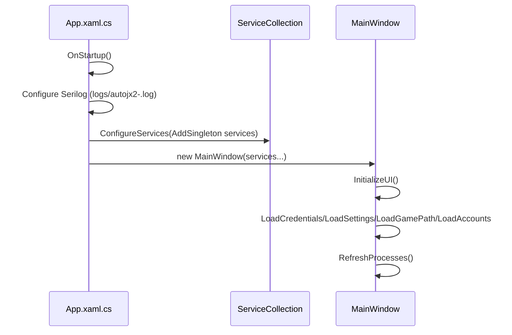
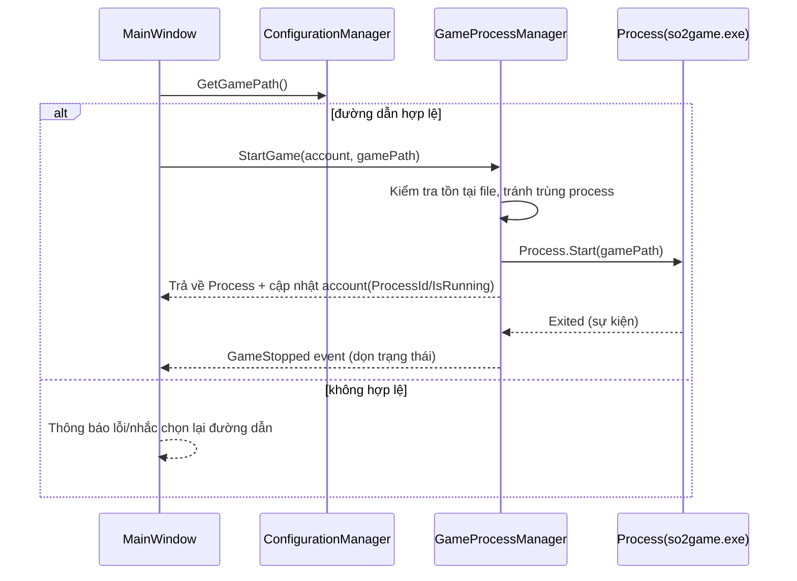
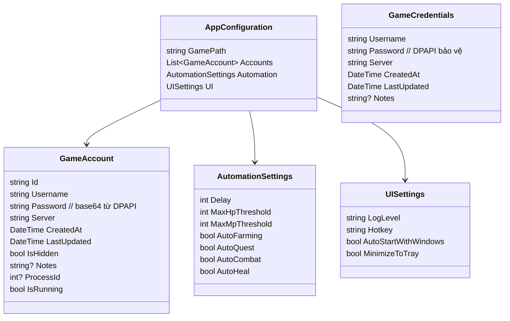

# AutoJx2 – Kiến trúc và Luồng Hoạt Động

Tài liệu mô tả cấu trúc thành phần, dữ liệu, và các luồng chính (khởi động, Auto Login, attach + automation) của ứng dụng.

## 1) Tổng Quan Kiến Trúc

```mermaid
graph LR
  U[Người dùng] -->|WPF UI| MW[MainWindow]
  subgraph Services
    CFG[IConfigurationManager<br/>ConfigurationManager]
    CRE[ICredentialManager<br/>CredentialManager]
    GPM[IGameProcessManager<br/>GameProcessManager]
    AUT[IGameAutomation<br/>GameAutomation (FlaUI)]
  end
  MW --> CFG
  MW --> CRE
  MW --> GPM
  MW --> AUT

  subgraph External
    FL[UIA3 / FlaUI]
    PROC[so2game.exe]
    WCM[Windows Credential Manager]
    DPAPI[Windows DPAPI]
    LOGS[Serilog -> logs/*.log]
  end
  AUT --> FL
  AUT --> PROC
  CRE --> WCM
  CRE --> DPAPI
  MW --> LOGS
```

Thành phần chính và vai trò:
- MainWindow: Điều phối UI, gọi services, cập nhật trạng thái.
- ConfigurationManager: Lưu/đọc `config.json` (đường dẫn game, accounts, settings).
- CredentialManager: Lưu thông tin đăng nhập an toàn (WCM + DPAPI).
- GameProcessManager: Mở/đóng, theo dõi process game theo từng account.
- GameAutomation: Attach vào process (FlaUI), chạy vòng lặp automation.

Tập tin liên quan:
- AutoJx2/App.xaml.cs:17 – Startup, DI, Serilog.
- AutoJx2/MainWindow.xaml(.cs) – UI chính và event handlers.
- AutoJx2/Services/* – Nghiệp vụ.
- AutoJx2/Models/* – Model dữ liệu.

## 2) Khởi Động Ứng Dụng



## 3) Auto Login – Bắt Đầu Game Theo Account



Điểm móc:
- Start: AutoJx2/MainWindow.xaml.cs:716 → `StartGameForAccount`.
- Logic: AutoJx2/Services/GameProcessManager.cs:30 → `StartGame`.

## 4) Attach + Automation Loop (FlaUI)

```mermaid
flowchart TD
  A[Chọn process trong ComboBox] --> B[AttachProcessButton_Click]
  B --> C[IGameAutomation.AttachToProcess(process)]
  C --> D[Application.Attach + GetMainWindow(UIA3)]
  D --> E[StartAutomationButton_Click]
  E --> F[StartAutomation]
  F --> G{_isRunning}
  G -->|true| H[Task.Run RunAutomationLoop]
  H --> I[PerformAutomationTasks theo flags]
  I --> J[Delay theo _delay]
  J --> H
  G -->|stop| K[StopAutomation - Cancel token]
```

Trích dẫn:
- Attach: AutoJx2/MainWindow.xaml.cs:140 → `_gameAutomation.AttachToProcess(process)`.
- Vòng lặp: AutoJx2/Services/GameAutomation.cs:122 → `RunAutomationLoop`.

## 5) Mô Hình Dữ Liệu



Nguồn:
- AutoJx2/Models/AppConfiguration.cs
- AutoJx2/Models/GameAccount.cs
- AutoJx2/Models/GameCredentials.cs

## 6) Bảo Mật & Lưu Trữ
- Mật khẩu account (trong config) được mã hóa bằng DPAPI ở phía UI trước khi lưu.
- Thông tin đăng nhập chung (tab Credentials) lưu trong Windows Credential Manager, blob JSON, DPAPI bảo vệ.
- Log ghi bằng Serilog: `logs/autojx2-*.log` (theo ngày, giữ tối đa 7 file).

## 7) Gợi Ý Render Diagram
- GitHub hiện hỗ trợ Mermaid trực tiếp trong Markdown.
- Trong VS Code, cài “Markdown Preview Mermaid Support” để xem sơ đồ ngay trong IDE.
- Nếu cần ảnh PNG/SVG, có thể dùng `mmdc` (Mermaid CLI) để xuất ảnh từ các khối Mermaid ở trên.

