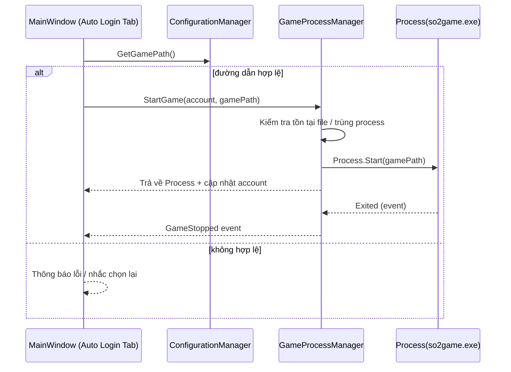
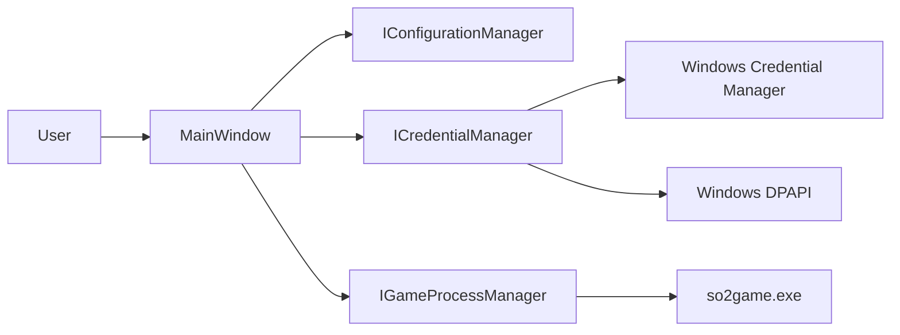

# Auto Login – Tài Liệu & Sơ Đồ

Tài liệu mô tả chi tiết tính năng Auto Login: các bước thao tác trên UI, dữ liệu/persistence, quản lý process, và sơ đồ minh họa.

## 1) Chức Năng
- Chọn và lưu đường dẫn game (`so2game.exe`).
- Quản lý danh sách account (thêm, sửa, ẩn/hiện, xóa).
- Khởi động game theo từng account; dừng process game.
- Lưu thông tin đăng nhập an toàn (Windows Credential Manager + DPAPI).

Liên quan UI: `AutoJx2/MainWindow.xaml` + `AutoJx2/MainWindow.xaml.cs`.

## 2) Dữ Liệu & Lưu Trữ
- `config.json` (cùng thư mục ứng dụng): đường dẫn game, danh sách account, automation/UI settings.
- `GameAccount.Password`: là chuỗi base64 từ DPAPI (mã hóa ở UI trước khi lưu).
- `GameCredentials`: blob JSON lưu ở Windows Credential Manager, được mã hóa bởi DPAPI.

Models: `AutoJx2/Models/*`.

## 3) Luồng Sử Dụng
1. Vào tab Auto Login → Chọn `so2game.exe` → Lưu.
2. Thêm Account (Username/Password/Server/Notes) → Lưu.
3. Double-click account hoặc dùng menu chuột phải → Start Game.
4. Dừng game: menu chuột phải → Stop Game.

## 4) Sơ Đồ Trình Tự – Start Game

Điểm móc quan trọng:
- `StartGameForAccount`: `AutoJx2/MainWindow.xaml.cs:716`
- `GameProcessManager.StartGame`: `AutoJx2/Services/GameProcessManager.cs:30`

## 5) Quản Lý Process
- Tránh chạy trùng cho cùng account (map `account.Id` → `Process`).
- Theo dõi `Process.Exited` để dọn trạng thái.
- Dừng riêng lẻ theo PID hoặc dừng tất cả.

Mã: `AutoJx2/Services/GameProcessManager.cs`.

## 6) Bảo Mật
- DPAPI: mã hóa mật khẩu account trước khi lưu vào `config.json`.
- Windows Credential Manager: lưu `GameCredentials` dạng blob JSON + DPAPI.

Mã: `AutoJx2/Services/CredentialManager.cs`, `AutoJx2/AddAccountWindow.xaml.cs`.

## 7) Sơ Đồ Thành Phần (Liên Quan Auto Login)

## 8) Gợi Ý Render Sơ Đồ
- GitHub và nhiều IDE render Mermaid trực tiếp.
- Cần file ảnh PNG/SVG: dùng Mermaid CLI (`mmdc`) để xuất từ các khối ở trên.

